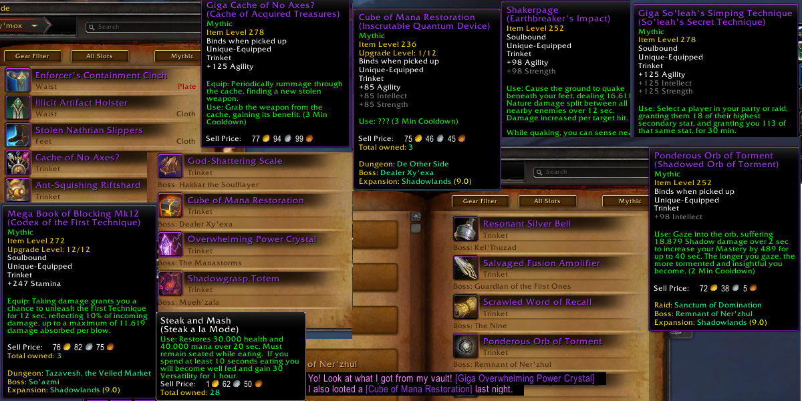

# MemeNames
Written by ___Zelix-Eldre'Thalas___.
  

Renames Items in-game through Addon Functionality to allow ridiculous names to be displayed instead of their default. 
Inspired by guildies refering to [Hymnal of the Path](https://www.wowhead.com/item=184840/hymnal-of-the-path?bonus=6935) as "**Book of Blasting**", and [Phial of Putrefaction](https://www.wowhead.com/item=178771/phial-of-putrefaction?bonus=6805:1472) as "**Granny Plague's Bathwater**".

---

**Features**:
1. Renames Items to appropriate jargon, slang, or memes coined by the \<Utsukushii Saisei\> guild.
2. Items with multiple entries will randomize each session.
3. Adding Prefix to ALL items of appropriate ilvl, currently 272 (Mega) and 278+ (Giga)
3. Holding Alt will display the Item's Real Name as well.

**Where to find new Names**:
* Item Tooltips
* Chat Messages
* Dungeon/Loot Journal
	
**Eventual, but Planned Features**:
* Rename items yourself
  * In-Game Sharing and Guild Syncing
* Add Options UI
* Effect More Frames (Weekly Vault / Guild Frame)
* Allow Randomized Items to Reroll Periodically
* Chaos Mode (Allow Random Names to not be session locked. Read FAQ for Details)
* Spells

**FAQ**:
* Does this break TOS?
  * No. This does not modify any files, and it strictly limited to Clients who have this AddOn installed and Enabled. Item Links do not change for other players without this addon. If Blizzard does not like the functionality they're free to break the methods used like previous broken addons.

* Can I rename items myself?
  * Yes, but through editing MemeNames.lua
  * Inside the { } of default items, you can a new line:
  * [\<ItemID\>]="\<NewName\>", -- Comment with Original Name
    * Just replace anything within \< \> with the approiate information.
  * You can get an Item's ID from WoWHead's Url: https://www.wowhead.com/item=\<id\>

* An item that's supposed to have a meme name didn't show up with it's new name in the Chat Window?
  * This is due to the way Blizzard handles item links, if you have not seen that item before the game will have to cache it with a localized name first.
  * To stop the addon from breaking, if it detects a nil from cache it'll skip that one time.

* Random isn't so Random?
  * Mousing Over Tooltips are constantly firing events to pick up if any Modifier Keys are Held Down. This will cause the Tooltip to jitter with random names. To Prevent this each Random Item is set to one of the Random Names upon seeing the item for the first time. Either relog or /reload to reroll item names.
  * If I have time, I may add a "chaos" mode that will continously cycle through the names, or eventually I'll make it re-randomize every so often.

* Do commands not work anymore?
  * I've disabled commands for now, I _plan_ (read Eventually) to rewrite the process and put it in a UI, that also lists items.
  * The main reason is so I didn't have to write an updater logic to handle new items being added and renamed.

* Localization?
  * I'm mono-lingual, different communities have different jokes and standards. The best I could accomplish is running it through Google Translate.
